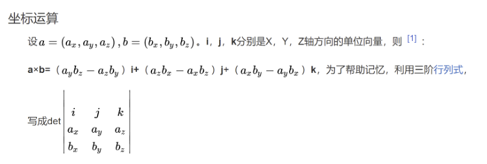

## inheritance
1. C++ gives us the ability to explicitly choose which Base class constructor will be called! To do this, simply add a call to the Base class constructor in the member initializer list of the derived class
    ```c++
    class Derived: public Base
    {
    public:
        double m_cost {};

        Derived(double cost=0.0, int id=0)
            : Base{ id } // Call Base(int) constructor with value id!
            , m_cost{ cost }
        {
        }

        double getCost() const { return m_cost; }
    };
    ```
    Memory for derived is allocated.
    The Derived(double, int) constructor is called, where cost = 1.3, and id = 5.
    The compiler looks to see if we’ve asked for a particular Base class constructor. We have! So it calls Base(int) with id = 5.
    The base class constructor member initializer list sets m_id to 5.
    The base class constructor body executes, which does nothing.
    The base class constructor returns.
    The derived class constructor member initializer list sets m_cost to 1.3.
    The derived class constructor body executes, which does nothing.
    The derived class constructor returns.

## virtual function
1. Note that if a function is marked as virtual, all matching overrides in derived classes are also implicitly considered virtual, even if they are not explicitly marked as such.
2. Use the virtual keyword on virtual functions in a base class.
3. Use the override specifier (but not the virtual keyword) on override functions in derived classes. This includes virtual destructors.
``` c++
class A
{
public:
	virtual std::string_view getName1(int x) { return "A"; }
	virtual std::string_view getName2(int x) { return "A"; }
	virtual std::string_view getName3(int x) { return "A"; }
};

class B : public A
{
public:
	std::string_view getName1(short int x) override { return "B"; } // compile error, function is not an override
	std::string_view getName2(int x) const override { return "B"; } // compile error, function is not an override
	std::string_view getName3(int x) override { return "B"; } // okay, function is an override of A::getName3(int)

};

```
## member function
Inline member functions

Member functions are not exempt from the ODR, so you may be wondering how we avoid ODR violations when member functions are defined in a header file (that may then be included into more than one translation unit).

Member functions defined inside the class definition are **implicitly inline. Inline functions are exempt from the one definition per program part of the one-definition rule**.

Member functions defined **outside the class definition are not implicitly inline** (and thus are subject to the one definition per program part of the one-definition rule). This is why such functions are usually defined in a code file (where they will only have one definition across the whole program).

Alternatively, member functions defined outside the class definition can be left in the header file **if they are made inline** (using the inline keyword). Here’s our Date.h header again, with the member functions defined outside the class marked as inline:

he function definition will be copied into multiple .cpp files. These files will then be compiled, and the linker will throw an error because it will note that you’ve defined the same function more than once, which is a violation of the one-definition rule.

***In modern C++, the term inline has evolved to mean “multiple definitions are allowed”. Thus, an inline function is one that is allowed to be defined in multiple translation units (without violating the ODR).***
```c++
#ifndef DATE_H
#define DATE_H

#include <iostream>

class Date
{
private:
    int m_year{};
    int m_month{};
    int m_day{};

public:
    Date(int year, int month, int day);

    void print() const;

    int getYear() const { return m_year; }
    int getMonth() const { return m_month; }
    int getDay() const { return m_day; }
};

inline Date::Date(int year, int month, int day) // now inline
    : m_year{ year }
    , m_month{ month }
    , m_day{ day }
{
}

inline void Date::print() const // now inline
{
    std::cout << "Date(" << m_year << ", " << m_month << ", " << m_day << ")\n";
};

#endif
```


## defalut argument
Default Values Must Be Specified in Function Declarations

The default values for parameters must be specified in the function declaration (or prototype). If a function is declared and defined separately, the default values must be in the declaration, not in definition.

## 行列式记忆
